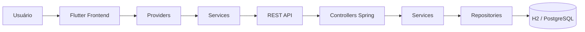

# Kira Marketplace

Marketplace de serviços locais construído como monorepo, com frontend em Flutter e backend em Spring Boot. O projeto cobre autenticação, cadastro de clientes e profissionais, catálogo de serviços, agendamentos, pagamentos, avaliações e navegação responsiva para web e mobile.

## Visão geral

O sistema foi organizado para separar claramente responsabilidade de interface, regras de negócio e acesso a dados:

- **Frontend**: experiência do usuário, telas, estados e consumo de API.
- **Backend**: autenticação, CRUDs, validações e persistência.
- **Integração**: comunicação via REST com JWT para autenticação.

## Arquitetura



### Frontend

O app Flutter segue uma organização por camadas:

- `lib/core`: constantes, tema e utilitários compartilhados.
- `lib/models`: DTOs e modelos de domínio consumidos pela interface.
- `lib/providers`: estado reativo e orquestração das chamadas de API.
- `lib/services`: client HTTP e integração com os endpoints.
- `lib/pages`: telas principais do produto.
- `lib/widgets`: componentes reutilizáveis e fluxos modais.

### Backend

O backend Spring Boot está estruturado por responsabilidade:

- `controller`: exposição dos endpoints REST.
- `service`: regras de negócio.
- `repository`: persistência com Spring Data JPA.
- `entity`: entidades do domínio.
- `dto`: payloads de entrada e saída.
- `security`: autenticação e autorização com JWT.
- `config`: configurações da aplicação.

## Stack e versões

### Frontend

| Tecnologia | Versão |
| --- | --- |
| Flutter | 3.41.9 |
| Dart | 3.11.5 |
| Versão do app | 1.0.0+1 |
| Provider | ^6.1.2 |
| Dio | ^5.7.0 |
| Flutter Map | ^7.0.0 |
| Google Fonts | ^6.2.1 |
| Image Picker | ^1.1.2 |
| Latlong2 | ^0.9.0 |

### Backend

| Tecnologia | Versão |
| --- | --- |
| Spring Boot | 3.3.5 |
| Java alvo | 17 |
| Versão do backend | 0.0.1-SNAPSHOT |
| JJWT | 0.12.6 |
| Lombok | 1.18.44 |
| Banco de desenvolvimento | H2 |
| Banco suportado | PostgreSQL |

### Endpoints do frontend

O frontend aponta para `http://localhost:8085`, configurado em `kira_marketplace_frontend/lib/core/constants/api_constants.dart`.

## Estrutura do projeto

```text
kira-marketplace/
├── kira_marketplace_frontend/
│   ├── lib/
│   ├── test/
│   └── pubspec.yaml
├── kira-marketplace-backend-v2/
│   ├── src/main/java/
│   └── pom.xml
└── docs/
    └── screenshots/
```

## Como executar

### Backend

```bash
cd kira-marketplace-backend-v2
./mvnw spring-boot:run
```

No Windows:

```powershell
cd kira-marketplace-backend-v2
.\\mvnw.cmd spring-boot:run
```

### Frontend

```bash
cd kira_marketplace_frontend
flutter pub get
flutter run
```

## Boas práticas adotadas

- Separação por camadas no frontend e no backend.
- Reaproveitamento de componentes visuais e widgets.
- Uso de modelos tipados para reduzir acoplamento com JSON bruto.
- Validação de fluxo com providers e serviços dedicados.
- Layout responsivo para web e mobile.
- Autenticação por token para proteger as rotas e chamadas do backend.

## Prints das telas

As imagens abaixo estão em `docs/screenshots/` e representam as principais telas do projeto.

### Home marketplace


### Perfil do profissional


### Agendamento


### Agendamentos


### Dashboard do profissional


### Meu perfil


## Observações

- Caso o backend esteja em outra porta, ajuste `baseUrl` em `kira_marketplace_frontend/lib/core/constants/api_constants.dart`.
- O projeto foi pensado para evoluir com novas jornadas, como persistência de sessão e refinamentos de notificações.
